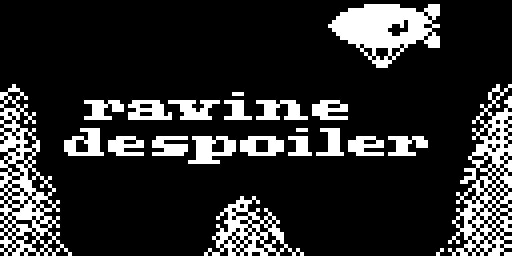

# Ravine Despoiler

a Arduboy game developed by Ben Combee

Released under Apache 2.0 license

* Arduboy2 library from https://github.com/MLXXXp/Arduboy2
* FixedPoint library from https://github.com/Pharap/FixedPointsArduino/
* ArduboyTones library from https://github.com/MLXXXp/ArduboyTones

This game was originally started for the black & white Pebble watch.  I ended up
getting some basic animation going and had it as a watch face, but I never implemented
the game controls.  After doing my first Arduboy game jam (which required all new
programming), I figured I'd come back to this one, porting over some of my Pebble code
and assets to the new platform.

It's based on the Atari arcade game Canyon Bomber.  You can speed up or slow down
your plane and drop bombs in the canyon to knock out boulders for points.  Missing
rocks will result in losing time, and when you run out of time, the game's over.  If
you clear a canyon, it magically refills.